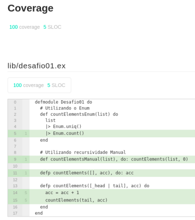

# Chapter 01 - Fundamentos do Elixir (Desafio 01)

1. Nesse desafio, você deverá criar uma função que, dada uma lista de números (exemplo `[1, 3, 6, 43, 6]`), calcule, **recursivamente**, quantos elementos há na lista e retorne esse valor.


## Passos Adicionais
1. Realização do mesmo desafio utilizando o Enum
2. Utilização da biblioteca [excoveralls](https://github.com/parroty/excoveralls) para monitoração dos testes da aplicação.

```
mix coveralls.html
```
3. Testes de Unidade para toda a aplicação (Incluindo as funções Enum)


## Conteúdo Desenvolvido nos Cursos

